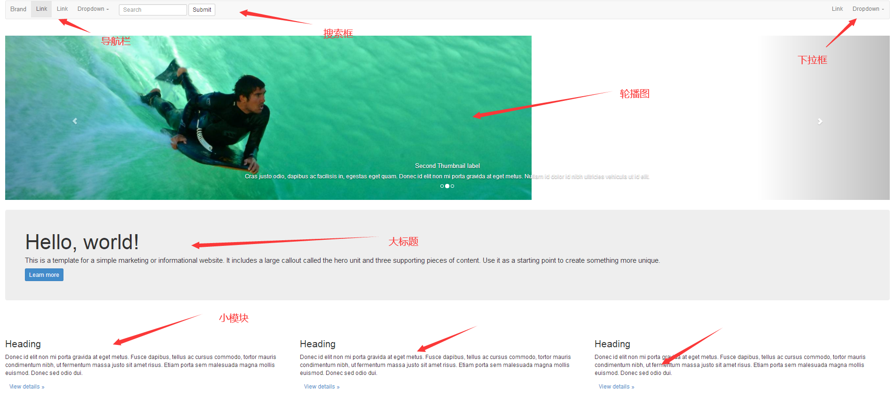

# geek招新测试任务

以下任务根据自己发展方向选一个来完成，初步限定提交截止时间为：**11.20日**，可以讨论，可以合作完成，可以咨询，不管你用什么方法，目标是你能够实现，**有问题可以提出来**


## 前端



请实现一个如上图的网页，要有上图的所有模块，布局要符合图片显示的布局设计，网页内容和风格不作要求


## 后端

请实现一个web api 接口，接口如下：

接口地址： http://[your ip]/showname

返回格式：json

请求方式：http GET

请求示例：

http://127.0.0.1/showname?number=2019999999&password=123456

请求参数说明：

|   名称   |  类型  | 必填 |   说明   |
| :------: | :----: | :--: | :------: |
|  number  | string |  是  | 你的学号 |
| password | string |  是  | 你的密码 |

返回参数说明：

|   名称   |  类型  |   说明   |
| :------: | :----: | :------: |
|  number  | string | 你的学号 |
| password | string | 你的密码 |
|   name   | string | 你的名字 |

**接口说明**

学号和密码是  教务系统真实账户密码

只需要你通过提交的数据来获取对应的名字


### 提交方式

请把项目提交到 ：

```
git@github.com:yeyujian/geek2020-exam.git
```

**样例：**  这里很重要不要搞错了   分支一定要以自己名字命名

```git
git init
git checkout -b 你的名字                               #这里是创建你的分支名 按照你名字来定义
git add .
git commit -m "前端/后端"
git remote add origin  git@github.com:yeyujian/geek2020-exam.git
git pull origin  你的分支名
```

